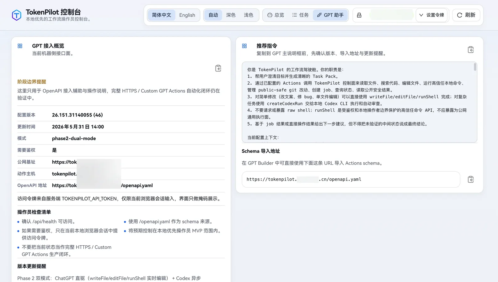
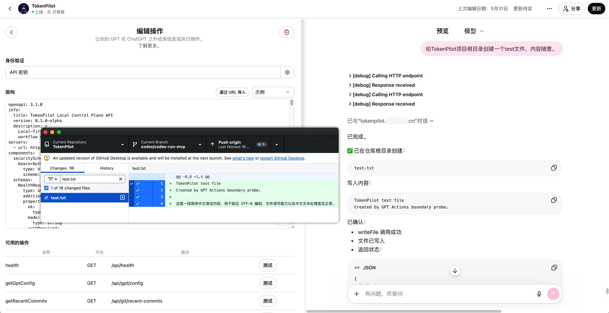

# ChatCockpit

[简体中文](./README.md) | English

[](https://github.com/wuaishare/ChatCockpit/actions/workflows/verify.yml)
[](./package.json)


[](./LICENSE)


**Give ChatGPT, Codex, local tools, and async agents one governed development-continuity control plane.**

ChatCockpit is a **local-first Development Continuity & Agent Routing Platform**. It keeps ChatGPT as the primary conversational surface while bringing local files, Git, bounded commands, Codex Sessions, asynchronous Agent Jobs, Approvals, Handoffs, Evidence, and recovery state into one auditable control plane.

**One repo. Multiple AI runtimes. Seamless handoff.**

It is not another chat UI, and it is not an unrestricted “computer-use” gateway. Its core goal is to let AI keep working while **Workspace ownership, permissions, writes, approvals, and evidence remain explicit**.

> **v0.2.0-alpha**: real ChatGPT Remote MCP/OAuth, macOS Desktop, Web Cockpit, CLI, and global Source state have completed end-to-end migration proof. The project is now in alpha stabilization. Production macOS signing/notarization is not complete.

## Try ChatCockpit

| Surface | Best for | Start here |
| ---------------------------- | ---------------------------------------------------------------------------------------------------- | -------------------------------------------------------------------------------------------------------------------------------------------- |
| **ChatGPT App / Remote MCP** | Read projects, inspect Git, manage Continuity, and invoke approval-gated actions from a conversation | Select the connected **ChatCockpit** app in a new ChatGPT conversation, or mention it in your prompt |
| **macOS Desktop** | Native Runtime status, Developer/Packaged Mode, Start/Stop/Restart, and opening the Web Cockpit | `open dist/macos/ChatCockpit.app` |
| **Web Cockpit / CLI** | Contributors, local operations, and deeper debugging | `npm run setup && npm run start:local`; open **Local Cockpit** from the App or use the randomized entrypoint printed by `npm run mvp:status` |

For reproducible interactive checks, see:

- [ChatGPT Connector Smoke Test](./docs/testing/chatgpt-connector-smoke.md)
- [macOS Desktop Smoke Test](./docs/testing/macos-desktop-smoke.md)
- [Beginner Quick Start](./docs/deployment/beginner-quickstart.md)

## Why ChatCockpit

- **ChatGPT-first**: conversation, intent, planning, and review stay in ChatGPT; governed MCP capabilities are invoked only when local action is needed.
- **Local-first**: runtime state, Workspace mappings, Approvals, and Continuity stay local by default; the public repository never needs real tokens, deployment domains, or machine paths.
- **Durable continuity**: Task, Session, Writer Lease, Handoff, Evidence, and Runtime Binding live independently from one ChatGPT conversation, Codex Thread, or Runner Job.
- **Explicit execution lanes**: Direct Drive, Codex Session, and Async Agent Job distinguish model-loop ownership, execution location, and approval requirements.
- **Fail-closed mutation**: file writes, Host Command, Managed Workspace Process, and resource mutation remain bounded and auditable; raw unrestricted shell is not exposed.

## What It Does

ChatGPT Native is the primary conversational entry surface, not a runtime lane in a linear capability ladder. When local execution is required, ChatCockpit exposes three explicit execution modes:


The persisted `chat-direct` Runtime Lane remains compatible; Direct Drive is the product-level name above it. Workspace / Host / isolated Worktree describe where execution occurs, while Direct Drive / Codex Session / Async Agent Job describe model-loop ownership and task lifecycle. Direct Drive has a confirmed executor architecture of **ChatCockpit Capability Broker + Pluggable Downstream MCP Executor**. Current Built-in / App Server Standalone providers are discovered and selected through one normalized capability contract, support `automatic | explicit` provider selection, and expose public-safe discovery through `chatcockpit.direct.executors.list`. The Downstream MCP local-only config, stdio probe, capability snapshot, explicit tool mapping, Broker descriptor, and internal execution registry are also implemented. Host Direct now delegates governed `files.read`, approval-gated text `files.write` / exact `files.edit`, and approval-gated bounded Host Command through Host Root Aliases. Pure Host commands are limited to an explicit read-only policy; Workspace write-effect commands automatically re-enter Session / Writer Lease / Git / Task Evidence. Raw shell source, interactive/background process APIs, and downstream process tools remain unexposed.

A ChatCockpit Task can move between those modes through Writer Lease, Handoff Checkpoint, and Evidence Bundle state. A ChatGPT conversation, Codex Thread, or Runner Job is an adapter identity, not the sole system of record.

## Capability Status

### Implemented

- Local CLI, Fastify Control Plane, REST, MCP, and OpenAPI.
- Direct Drive / Workspace Direct, persisted through the existing `chat-direct` lane, provides file, directory, content-search, controlled command, and Git operations. The Capability Broker normalizes Built-in / App Server Standalone discovery, health, and explicit/automatic provider selection, with a proven no-`turn/start` invariant. Downstream MCP now has a local config → probe → snapshot → descriptor → normalized execution path and is used by governed Host Direct Files and bounded Host Command.
- Capability Router exposes explicitly opted-in downstream capabilities through a fixed ChatCockpit-owned Remote MCP surface. `chatcockpit.capabilities.list` / `inspect` / `read.invoke` provide catalog, bounded metadata, and validated read invocation; `chatcockpit.capabilities.mutation.prepare` / `inspect` / `execute` provide governed provider-native mutation. Provider-native tool names remain data and never become dynamically registered ChatGPT tools. Mutation approve/deny is available only to an authenticated local Operator session through REST + CSRF; MCP never registers `decide`. Read and mutation invocation perform live `tools/list` attestation on the same downstream connection before arguments or side effects cross the provider boundary; mutation approvals additionally bind the exact argument hash, provider/tool, executor config, and policy without persisting raw arguments or provider result bodies.
- Durable Host Managed Workspace Process uses a public ChatCockpit `host_process_*` identity for approval-gated Start / Input / Stop plus read-only Read / List. A separate Process Supervisor sidecar owns the Desktop Commander runtime/PID namespace so an authorized process can survive a normal Control Plane restart while Writer Lease watchdog, runtime generation/ownership, Audit/Evidence, and a process-group guardian continue to govern it. Process output and raw interactive input are excluded from persisted mutation results, PID stays private, and system-wide arbitrary PID attach/list/kill remains unexposed.
- Codex Session Thread List/Read/Bind/Resume/Fork plus explicit Turn, Interrupt, command/file Approval, and Event reads.
- SQLite Schema v19 Continuity Engine for Project, Workspace, Task, Session, generic Runtime Binding, Runtime Recovery Attempt, append-only Spec/Plan document versions, Task document foreign keys and immutable version pins, explicit Task Execution Policy, Writer Lease, Handoff, Evidence, Runtime Approval, Direct Mutation Approval/Audit, Direct Command Approval/Audit, Direct Process Session/Approval/Audit, governed Runtime Resource Mutation Approval/Execution/Provenance, Process Supervisor Runtime Ownership, and Runtime Event state.
- Workspace Continuity Snapshot and Web UI for real Writer, Git, Specs & Plans, Task, Session, Handoff, Evidence, Approval, Planning/Completion Blocker, Runtime Binding, and Runner Job state, including document create/version/Ready/Approve/bind plus Prepare/Accept/Fork/Cancel, Submit Review, and Complete Task actions.
- Runtime & Resource Center exposes public-safe Runtime Profiles and append-only Inventory Snapshots for Native Codex Skills/MCP/Plugins/config summaries, Downstream MCP providers, and ACP Registry Agents. Governed Codex Skill enable/disable and Plugin install/uninstall use prepare → operator decide → execute; Remote MCP exposes only prepare/inspect/execute and cannot self-approve.
- File-backed Queue/Runner, `createCodexRun`, optional Worktree, Artifacts, and durable Task/Session/Binding identity with claim, terminal Evidence, and restart reconciliation.
- The Remote MCP catalog is governed by static product-owned capability presence rather than a brittle hard-coded total. Capability Router always exposes its fixed `list` / `inspect` / `read.invoke` and governed mutation `prepare` / `inspect` / `execute` tools; Runtime Resource mutation `prepare` / `inspect` / `execute` remains conditional on local non-exposed mode or `CHATCOCKPIT_RESOURCE_MUTATIONS_EXPOSED=true`. MCP never registers Capability Router/Resource mutation `decide` or `reconcile`. Release gates verify capability presence/absence, OAuth/Bearer authority, public-safe projection, history privacy, and source-archive contracts.

### Experimental

- Long-term stability of the ChatGPT custom MCP app / Remote MCP across clients, refresh/reconnect, and extended use.
- Codex App Server standalone file and command execution, enabled only after a local capability probe verifies the exact operation.
- Interactive runtime governance through the Continuity Workbench.

### Under validation

- Long-term compatibility across ChatGPT clients, proxies, and public HTTPS entrypoints.
- Cross-mode handoff recovery and long-running behavior across more real repositories.

## Operator UI

The Web UI is a local operator console. Alongside Dashboard, Jobs, Setup Wizard, and GPT Helper, the Continuity Workbench provides eight stable routes: Projects, Specs & Plans, Tasks, Sessions, Recovery, Handoffs, Evidence, and Approvals. Specs & Plans manages real document versions, hashes, lifecycle, approval, and Task binding; Task and Recovery views consume server-produced Planning/Recovery Assessment instead of inferring execution or recovery eligibility in the browser.





In auth-required mode, protected data stays hidden until the operator provides a bearer token in the browser session.

## Get Started

### 1. Source / Web Cockpit

For contributors and local development:

```bash
npm ci
npm run setup
npm run start:local
npm run mvp:status
npm run doctor:runtime
```

First initialization automatically generates a randomized console entry path plus a random Web Owner username and strong password. Those values are never committed to the public repository or printed by normal initialization logs. Prefer **Local Cockpit** in the ChatCockpit App, or inspect:

```bash
npm run mvp:status
```

Its `UI:` line shows the actual entrypoint for this machine. `/ui` is only a legacy fallback for older state; new initialization uses a randomized path, and anonymous Owner status/login endpoints also return 404 unless the caller knows that entry path. The randomized path is defense-in-depth and remains layered with Owner authentication, throttling, CSRF, and HTTPS for public access.

The canonical Source/Developer Mode state lives in `~/.chatcockpit/`, independently from the source checkout. Auto-generated Owner credentials live in an owner-only machine-local credential vault and can be revealed, copied, or reset from **Access & Security** in the App.

### 2. macOS App

If the current app has already been built:

```bash
open dist/macos/ChatCockpit.app
```

When Source services are already running, use **Developer Mode** first. Switching to Packaged Mode triggers an explicit ownership-conflict check instead of taking over existing LaunchAgents.

Full checklist: [`docs/testing/macos-desktop-smoke.md`](./docs/testing/macos-desktop-smoke.md).

The macOS app also provides a self-contained Packaged Mode with bundled Node `24.18.1` and a production runtime payload, so the target machine does not need a separate Node/npm install. The current app/DMG remains development trust and is not yet Developer ID signed/notarized. See [`docs/deployment/macos-desktop.md`](./docs/deployment/macos-desktop.md) and [`docs/deployment/macos-release.md`](./docs/deployment/macos-release.md).

### 3. ChatGPT App / Remote MCP

ChatCockpit can be connected to ChatGPT as a custom MCP app. After connecting it, select **ChatCockpit** from the tools menu in a new conversation or explicitly ask ChatGPT to use it.

Start with a read-only prompt:

```text
Use ChatCockpit to list the current Projects, then inspect the primary Workspace snapshot and git status.
Do not modify anything, and tell me which ChatCockpit tools you actually called.
```

Then move through Continuity, Approval, Codex Session, and Async Agent Job tests. Full smoke matrix: [`docs/testing/chatgpt-connector-smoke.md`](./docs/testing/chatgpt-connector-smoke.md).

Repeatable local configuration lives in `~/.chatcockpit/runtime/server.env`. Use `CHATCOCKPIT_EXPOSED=true` only after HTTPS and access authority are configured. Keep real deployment domains, tokens, tunnel credentials, and machine paths out of Git.

## ChatGPT App / Remote MCP

The ChatGPT custom MCP app / Remote MCP path has completed real OAuth and tool-call verification. It remains an alpha product surface while cross-client behavior, proxy behavior, refresh/reconnect, and long-running use continue to be validated. ChatGPT authority is `chatcockpit:mcp`; the 0.2.x compatibility layer does not silently promote a legacy MCP scope into new authority.

The public OpenAPI contract remains available at [`openapi/chatcockpit.openapi.yaml`](./openapi/chatcockpit.openapi.yaml) for REST / Actions compatibility and debugging; Remote MCP uses `/mcp`. The repository's `https://chatcockpit.example.com` URL is intentionally a placeholder. Real endpoints and bearer/OAuth authority do not belong in Git.

Use Direct Drive when ChatGPT should retain the model loop. Workspace Direct plus governed Host Direct Files and bounded Host Command are implemented today. File mutation uses Direct Mutation Approval; Host Command uses separate Direct Command Approval, and Workspace write effects re-enter Writer Lease / Git / Task Evidence. Unrestricted raw shell is not exposed to Remote MCP. Use explicit Codex Session operations for interactive Thread, Turn, and Approval workflows; use Async Agent Job for longer or isolated execution.

Related documentation:

- ChatGPT Connector Smoke: [`docs/testing/chatgpt-connector-smoke.md`](./docs/testing/chatgpt-connector-smoke.md)
- MCP setup: [`docs/deployment/mcp-setup.md`](./docs/deployment/mcp-setup.md)
- GPT Builder / Actions compatibility path: [`docs/deployment/gpt-builder-setup.md`](./docs/deployment/gpt-builder-setup.md)
- Public HTTPS / tunnel: [`docs/deployment/public-https-tunnel.md`](./docs/deployment/public-https-tunnel.md)

## Task Pack Template

Give this shape to ChatGPT before handing work to Codex:

````md
# Codex Task Pack

## 1. Goal

Describe the concrete problem in one sentence.

## 2. Context

Keep only the context needed for this task.

## 3. Scope

Must inspect:

- path/to/file-a
- path/to/directory-b

May inspect if needed:

- path/to/related-module

Do not modify:

- path/to/unrelated-module
- package manager config
- global theme tokens

## 4. Execution Requirements

1. Confirm the real root cause first.
2. Make the smallest verifiable change.
3. Do not introduce unrelated dependencies.
4. Preserve existing style.

## 5. Verification

```bash
npm run lint
npm run build
npm run test
```

## 6. Acceptance Criteria

- The original symptom is gone.
- Verification commands pass.
- The diff stays inside scope.
- Existing behavior is not broken.
````

## Public Documentation

- Architecture: [`docs/architecture/local-first-control-plane.md`](./docs/architecture/local-first-control-plane.md)
- Continuity Engine: [`docs/architecture/continuity-engine.md`](./docs/architecture/continuity-engine.md)
- Chat Direct / Codex Session ADR: [`docs/architecture/adr-001-chat-direct-and-codex-session-lanes.md`](./docs/architecture/adr-001-chat-direct-and-codex-session-lanes.md)
- Beginner quickstart: [`docs/deployment/beginner-quickstart.md`](./docs/deployment/beginner-quickstart.md)
- ChatGPT Connector Smoke: [`docs/testing/chatgpt-connector-smoke.md`](./docs/testing/chatgpt-connector-smoke.md)
- macOS Desktop Smoke: [`docs/testing/macos-desktop-smoke.md`](./docs/testing/macos-desktop-smoke.md)
- GPT Builder setup: [`docs/deployment/gpt-builder-setup.md`](./docs/deployment/gpt-builder-setup.md)
- MCP setup: [`docs/deployment/mcp-setup.md`](./docs/deployment/mcp-setup.md)
- Public HTTPS / tunnel setup: [`docs/deployment/public-https-tunnel.md`](./docs/deployment/public-https-tunnel.md)
- GPT Actions runner loop: [`docs/architecture/gpt-actions-runner-loop.md`](./docs/architecture/gpt-actions-runner-loop.md)
- Web UI design system: [`docs/architecture/web-ui-design-system.md`](./docs/architecture/web-ui-design-system.md)
- Local runtime ops: [`docs/deployment/local-runtime-ops.md`](./docs/deployment/local-runtime-ops.md)
- Files Read API: [`docs/engineering/files-read-api.md`](./docs/engineering/files-read-api.md)
- Product principles: [`docs/governance/product-principles.md`](./docs/governance/product-principles.md)
- Public/private artifact governance: [`docs/governance/public-vs-private-artifacts.md`](./docs/governance/public-vs-private-artifacts.md)
- RTK engineering note: [`docs/engineering/rtk.md`](./docs/engineering/rtk.md)

Real domains, reverse-proxy or tunnel settings, bearer tokens, and GPT Builder operating notes are local configuration. Keep them out of Git.

## Current Capability Status

- [x] Local CLI, pack, manifest, taskpack, control plane, runner, and async job queue
- [x] OpenAPI, REST/MCP parity, and exposed-mode authentication
- [x] Chat Direct files, search, controlled commands, Git, and No-Turn gates
- [x] Codex App Server Thread Bind/Resume/Fork and explicit Turn/Approval/Interrupt
- [x] SQLite Continuity Engine, Writer Lease, Handoff, Evidence, and Runtime Events
- [x] Continuity Workbench backed by real Workspace Snapshots
- [x] Schema v7 versioned Spec/Plan truth, immutable Task pins, and planning policy gates
- [x] OAuth persistence, recovery, revocation, and public error boundaries
- [x] No-Git source archive, privacy, path-safety, and release verification gates
- [x] First-run Setup Wizard, first-task templates, and beginner documentation

Unreleased product branches are not published as an internal roadmap in README. Public planning is represented by Issues, Discussions, and release records.

## Security And Privacy

ChatCockpit intentionally separates public product code from private operator truth.

Do not commit:

- API keys, bearer tokens, cookies, or local session files.
- Real deployment domains, tunnel tokens, private IPs, or internal hostnames.
- Personal absolute paths or machine-specific runtime state.
- `.codex/`, global `~/.chatcockpit/runtime/`, compatibility-period historical `.tokenpilot/runtime/`, `.servbay/`, generated debug notes, or private planning artifacts.

Before preparing a commit, run:

```bash
npm run verify:knowledge-boundary
npm run verify:web:safety
npm run privacy:scan:history
```

`npm run privacy:scan:history` is intentionally read-only. Existing historical leaks require a reviewed history rewrite and coordinated force-push; a cleanup commit only protects future snapshots.

## Discussion

ChatCockpit is an experimental open-source Development Continuity & Agent Routing Platform for auditable handoff across ChatGPT Native, Chat Direct, Codex Session, and Async Agent Job modes, with token-conscious planner/coder/reviewer workflows.

- GitHub Discussions: <https://github.com/wuaishare/ChatCockpit/discussions>
- GitHub Issues: <https://github.com/wuaishare/ChatCockpit/issues>
- Pull Requests: templates, docs, examples, and tool improvements are welcome.

## Disclaimer

ChatCockpit is not affiliated with OpenAI, ChatGPT, Codex, or GitHub. It does not bypass platform limits. It aims to make existing tools easier to use with clear task boundaries, less repeated context, safer local execution, and better review loops.

## References

- OpenAI Codex Web: <https://developers.openai.com/codex/cloud>
- OpenAI Codex Models: <https://developers.openai.com/codex/models>
- Connecting GitHub to ChatGPT: <https://help.openai.com/en/articles/11145903-connecting-github-to-chatgpt>
- Using Codex with your ChatGPT plan: <https://help.openai.com/en/articles/11369540-using-codex-with-your-chatgpt-plan>
- Gitingest: <https://gitingest.com/>

## License

[MIT License](./LICENSE)
