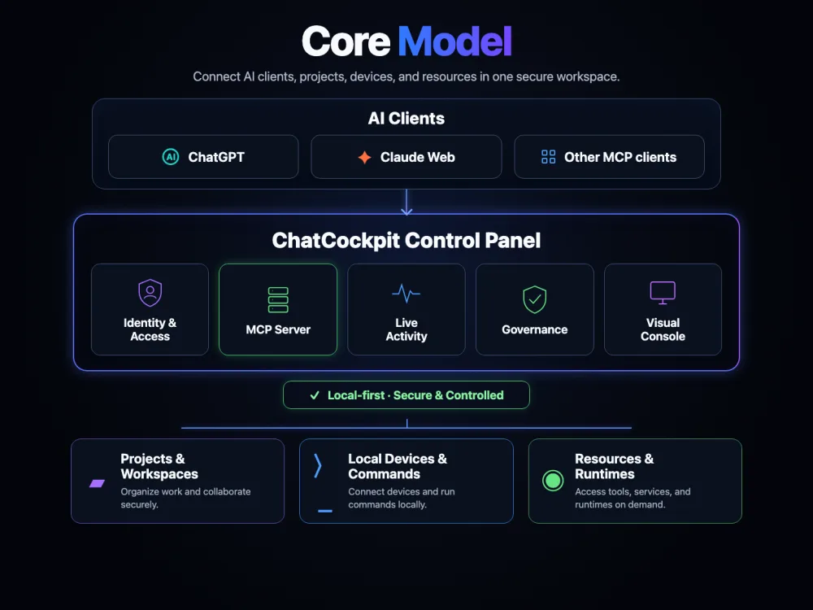

# ChatCockpit

[简体中文](./README.md) | English

[](https://github.com/wuaishare/ChatCockpit/actions/workflows/verify.yml)
[](./package.json)


[](./LICENSE)


> **Chat is the interface. Cockpit is the control plane.**

ChatCockpit is a **local-first control panel for AI work**. It gives ChatGPT, Claude Web, and other MCP-compatible AI clients one governed entry point to projects, local devices, commands, resources, and runtimes.

Identity and access, the MCP server, live activity, governance, and the visual console stay in one place so AI can act while people can still observe, govern, and revoke access when needed.

It is not trying to become another AI chat client, IDE, universal runtime, or app store. The goal is to connect mature tools behind one safe control plane so complex software environments become easier to use and manage from Chat.

> **Current status: v0.2.0-alpha.** The Capability/Governance kernel, stable Capability Router, Remote MCP/OAuth, Resource Center foundation, macOS/Web operator surfaces, and Development Continuity capabilities exist today. Deeper provider lifecycle management and a more complete software/capability management experience are still being validated.

## Core model



Think of ChatCockpit as a **secure control panel between AI clients and the environment where work happens**:

- **AI clients on top**: ChatGPT, Claude Web, and other MCP-compatible clients.
- **ChatCockpit in the middle**: identity and access, the MCP server, live activity, governance, and the visual console.
- **Work targets below**: projects and workspaces, local devices and commands, resources and runtimes.

AI clients do not need to understand every local tool directly; ChatCockpit turns those capabilities into a stable, observable, governable work surface.
## What works today

- **Remote MCP / OAuth** — ChatGPT reaches a fixed governed ChatCockpit tool surface through one product boundary. Each Owner approval creates an independent Authorization Grant; access/refresh tokens bind to that grant, legacy OAuth state migrates without invalidating existing refresh tokens, and the Web Owner can inspect or revoke one grant/token family independently.
- **Capability Router** — catalog, inspect, read invocation, and governed provider-native mutation with live `tools/list` attestation.
- **Downstream MCP** — official MCP client with local stdio and constrained Streamable HTTP, plus bounded schema/annotation catalogs.
- **Resource Center** — `local-device`, a provider-management read model, Runtime Profiles, append-only inventory, and governed resource operations. The management view unifies detection, version, health, configuration source, Chat exposure, desired/observed state, and provider-native verification.
- **Governance** — Approval, idempotency, Evidence, public-safe projections, and actor provenance; raw mutation arguments and provider result bodies are not stored in Governance records.
- **Host / Workspace capabilities** — allowlisted files, bounded commands, Git, and governed Managed Workspace Processes without exposing unrestricted raw shell or arbitrary system PID control.
- **Development Continuity** — Task / Session / Handoff / Evidence / Recovery, explicit Codex Sessions, async Agent Jobs, and Writer Lease.
- **Operator surfaces** — macOS App, Menu Bar, Web Cockpit, and CLI, all sharing the same local control plane and authority model.

## Why ChatCockpit

Many AI tools already provide filesystem, shell, coding, MCP, agent, or automation capabilities. ChatCockpit should not rebuild all of them. It focuses on the hard cross-tool layer:

- **One entry point** — ChatGPT does not need a separate connector for every local tool.
- **Stable capability surface** — downstream changes do not dynamically pollute the upstream tool contract.
- **Governed mutation** — read, write, approval, execution, and evidence boundaries stay explicit.
- **Provider-native truth** — runtime metadata is re-attested before side effects rather than trusting stale snapshots.
- **Local-first authority** — real machine state, credentials, absolute paths, and private runtime details stay local by default.
- **Cross-tool continuity** — when development handoff is needed, Tasks, Handoffs, and Evidence do not depend on one chat thread staying alive.

## Try it

| Surface | Purpose |
|---|---|
| **ChatGPT App / Remote MCP** | Discover and invoke governed ChatCockpit capabilities from chat |
| **macOS App / Menu Bar** | Manage local runtime, access, security, and health |
| **Web Cockpit** | Resource Center, Continuity, Jobs, Integrations, and operator workflows |
| **CLI** | Local development, diagnostics, verification, and automation |

Source mode:

```bash
npm ci
npm run setup
npm run start:local
npm run mvp:status
npm run doctor:runtime
```

Do not assume the Web UI lives at `/ui`. Fresh initialization creates a randomized secure console path. Prefer opening **Local Cockpit** from the ChatCockpit App or reading the `UI:` line from `npm run mvp:status`.

Guides:

- [Beginner quickstart](./docs/deployment/beginner-quickstart.md)
- [ChatGPT / MCP setup](./docs/deployment/mcp-setup.md)
- [macOS Desktop](./docs/deployment/macos-desktop.md)
- [Local runtime operations](./docs/deployment/local-runtime-ops.md)
- [Local-first control-plane architecture](./docs/architecture/local-first-control-plane.md)
- [Product principles](./docs/governance/product-principles.md)
- [Public vs private artifacts](./docs/governance/public-vs-private-artifacts.md)
- [ChatGPT connector smoke](./docs/testing/chatgpt-connector-smoke.md)

## Security boundary

ChatCockpit is not designed to give an AI unrestricted machine authority. Important invariants include:

- explicit allowlists and canonical path containment;
- bounded, redacted public-safe projections;
- server-side policy and local Operator Authority for meaningful mutations;
- no Remote MCP self-approval for governed writes;
- no automatic exposure of raw downstream tools, raw shell, private transport config, secrets, PIDs, or real machine paths merely because they are visible locally;
- provider metadata/schema drift blocks execution before side effects.

## Project and contribution

ChatCockpit is still alpha. Issues and pull requests are welcome around the current public contract, especially protocol compatibility, security boundaries, provider interoperability, Resource Center reliability, macOS packaging, documentation, and repeatable verification.

This public repository documents current product behavior, public interfaces, and contributor-facing invariants.

## License

[MIT](./LICENSE)
