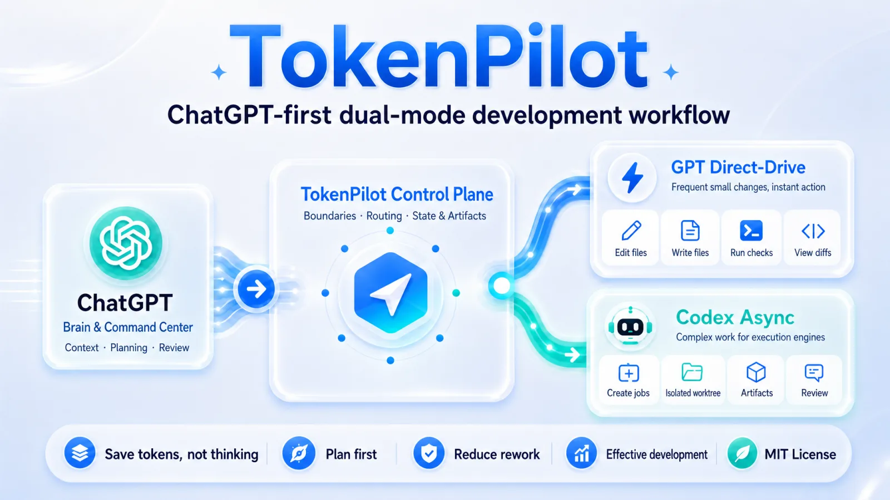
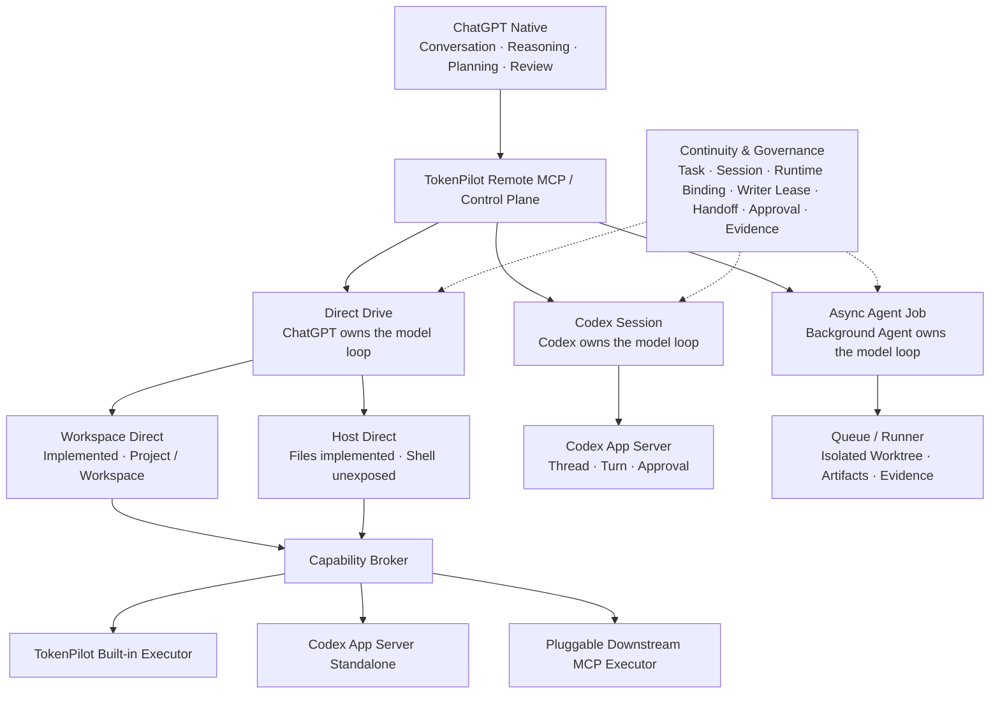

# TokenPilot

[简体中文](./README.md) | English



**v0.1.0-alpha: local-first public preview**

TokenPilot is a ChatGPT-first **Development Continuity & Agent Routing Platform**.

**One repo. Multiple AI runtimes. Seamless handoff.**

ChatGPT owns conversation, intent, planning, and review. TokenPilot provides the local-first control plane for Project, Workspace, Task, Session, Writer Lease, Handoff, Evidence, Approval, and Runtime Binding state. Codex App Server and the local Runner provide explicit Codex Session and asynchronous Agent Job execution.

Save tokens, not thinking. Plan first, reduce rework, and ship more effective changes.

The current alpha implements and locally verifies a CLI, Fastify Control Plane, REST/MCP/OpenAPI, Chat Direct routing, Codex Thread Bind/Resume/Fork, explicit Turn/Approval/Interrupt, SQLite continuity state, versioned Spec/Plan truth with REST/MCP operations and immutable Task version pins, explicit `planning-required | planning-optional` execution policy, Writer Lease, structured Handoff and Evidence, Workspace Continuity Snapshot, evidence-governed Task Review/Completion, Continuity-bound Async Job Queue, Runner claim/terminal/restart reconciliation, 50 MCP tools, and a Continuity Workbench Web UI for Spec/Plan creation, versioning, approval, binding, and real planning blockers.

## What It Does

ChatGPT Native is the primary conversational entry surface, not a runtime lane in a linear capability ladder. When local execution is required, TokenPilot exposes three explicit execution modes:



The persisted `chat-direct` Runtime Lane remains compatible; Direct Drive is the product-level name above it. Workspace / Host / isolated Worktree describe where execution occurs, while Direct Drive / Codex Session / Async Agent Job describe model-loop ownership and task lifecycle. Direct Drive has a confirmed executor architecture of **TokenPilot Capability Broker + Pluggable Downstream MCP Executor**. Current Built-in / App Server Standalone providers are discovered and selected through one normalized capability contract, support `automatic | explicit` provider selection, and expose public-safe discovery through `tokenpilot.direct.executors.list`. The Downstream MCP local-only config, stdio probe, capability snapshot, explicit tool mapping, Broker descriptor, and internal execution registry are also implemented. Host Direct now delegates governed `files.read` plus approval-gated text `files.write` / exact `files.edit` through Host Root Aliases to verified downstream execution. Registered Workspace targets automatically re-enter Session / Writer Lease / Git / Task Evidence governance, while Pure Host targets record public-safe Audit. Host Shell remains unexposed.

A TokenPilot Task can move between those modes through Writer Lease, Handoff Checkpoint, and Evidence Bundle state. A ChatGPT conversation, Codex Thread, or Runner Job is an adapter identity, not the sole system of record.

## Capability Status

### Implemented

- Local CLI, Fastify Control Plane, REST, MCP, and OpenAPI.
- Direct Drive / Workspace Direct, persisted through the existing `chat-direct` lane, provides file, directory, content-search, controlled command, and Git operations. The Capability Broker normalizes Built-in / App Server Standalone discovery, health, and explicit/automatic provider selection, with a proven no-`turn/start` invariant. Downstream MCP now has a local config → probe → snapshot → descriptor → normalized execution path and is used by governed Host Direct Files.
- Codex Session Thread List/Read/Bind/Resume/Fork plus explicit Turn, Interrupt, command/file Approval, and Event reads.
- SQLite Schema v8 Continuity Engine for Project, Workspace, Task, Session, generic Runtime Binding, append-only Spec/Plan document versions, Task document foreign keys and immutable version pins, explicit Task Execution Policy, Writer Lease, Handoff, Evidence, Runtime Approval, Direct Mutation Approval/Audit, and Runtime Event state.
- Workspace Continuity Snapshot and Web UI for real Writer, Git, Specs & Plans, Task, Session, Handoff, Evidence, Approval, Planning/Completion Blocker, Runtime Binding, and Runner Job state, including document create/version/Ready/Approve/bind plus Prepare/Accept/Fork/Cancel, Submit Review, and Complete Task actions.
- File-backed Queue/Runner, `createCodexRun`, optional Worktree, Artifacts, and durable Task/Session/Binding identity with claim, terminal Evidence, and restart reconciliation.
- 50 MCP tools, including Direct Drive executor discovery, Host Root Alias discovery, Host Direct file read, the approval-gated `prepare → decide → execute` Host Write / Exact Edit lifecycle, Spec/Plan create/read/version/lifecycle/Task-binding operations, exposed-mode Bearer Auth, public-safe projections, history privacy scanning, and source-archive operation without `.git` metadata.

### Experimental

- Connecting ChatGPT through Custom GPT Actions or Remote MCP.
- Codex App Server standalone file and command execution, enabled only after a local capability probe verifies the exact operation.
- Interactive runtime governance through the Continuity Workbench.

### Under validation

- Long-term compatibility across ChatGPT clients, proxies, and public HTTPS entrypoints.
- Cross-mode handoff recovery and long-running behavior across more real repositories.

## Operator UI

The Web UI is a local operator console. Alongside Dashboard, Jobs, Setup Wizard, and GPT Helper, the Continuity Workbench provides seven stable routes: Projects, Specs & Plans, Tasks, Sessions, Handoffs, Evidence, and Approvals. Specs & Plans manages real document versions, hashes, lifecycle, approval, and Task binding; the Task view consumes server-produced Planning Assessment instead of inferring execution eligibility in the browser.


In auth-required mode, protected data stays hidden until the operator provides a bearer token in the browser session.

## Quick Start

```bash
npm run setup
npm run start:local
npm run mvp:status
npm run doctor
```

See the beginner path in [`docs/deployment/beginner-quickstart.md`](./docs/deployment/beginner-quickstart.md).

Start the paired local control plane and runner on macOS:

```bash
npm run mvp:start
npm run mvp:status
npm run doctor:runtime
```

Open the local operator UI:

```text
http://127.0.0.1:4318/ui
```

For a repeatable local setup, place runtime variables in `.tokenpilot/runtime/server.env`:

```bash
TOKENPILOT_API_TOKEN=replace-with-your-builder-token
TOKENPILOT_EXPOSED=false
TOKENPILOT_HOST=127.0.0.1
TOKENPILOT_PORT=4318
```

Use `TOKENPILOT_EXPOSED=true` only after you have configured HTTPS and an access token. Keep real domains, reverse-proxy or tunnel settings, bearer tokens, and machine-specific paths out of Git.

## Custom GPT Actions Status

The public OpenAPI contract is available in [`openapi/tokenpilot.openapi.yaml`](./openapi/tokenpilot.openapi.yaml). The placeholder server URL `https://tokenpilot.example.com` is intentionally generic. Replace it with your own HTTPS URL when configuring GPT Builder, and do not commit real domains or bearer tokens to Git.

Custom GPT Actions and Remote MCP remain experimental deployment surfaces, while the local REST/MCP application services, authentication, structured errors, idempotency, and protocol release gates are implemented. Use Direct Drive when ChatGPT should retain the model loop; Workspace Direct and governed Host Direct Files are implemented today. Host read remains read-only, while text Write / Exact Edit require short-lived single-use Direct Mutation Approval and automatically re-enter Writer Lease / Git / Task Evidence governance for Workspace targets. Host Shell remains unexposed. Use explicit Codex Session operations for interactive Thread, Turn, and Approval workflows; use `createCodexRun` for longer or isolated Async Agent Jobs.

For Custom GPT creation, Actions schema import, authentication, and public HTTPS/tunnel setup, see:

- [`docs/deployment/gpt-builder-setup.md`](./docs/deployment/gpt-builder-setup.md)
- [`docs/deployment/public-https-tunnel.md`](./docs/deployment/public-https-tunnel.md)

## Task Pack Template

Give this shape to ChatGPT before handing work to Codex:

````md
# Codex Task Pack

## 1. Goal

Describe the concrete problem in one sentence.

## 2. Context

Keep only the context needed for this task.

## 3. Scope

Must inspect:
- path/to/file-a
- path/to/directory-b

May inspect if needed:
- path/to/related-module

Do not modify:
- path/to/unrelated-module
- package manager config
- global theme tokens

## 4. Execution Requirements

1. Confirm the real root cause first.
2. Make the smallest verifiable change.
3. Do not introduce unrelated dependencies.
4. Preserve existing style.

## 5. Verification

```bash
npm run lint
npm run build
npm run test
```

## 6. Acceptance Criteria

- The original symptom is gone.
- Verification commands pass.
- The diff stays inside scope.
- Existing behavior is not broken.
````

## Public Documentation

- Architecture: [`docs/architecture/local-first-control-plane.md`](./docs/architecture/local-first-control-plane.md)
- Continuity Engine: [`docs/architecture/continuity-engine.md`](./docs/architecture/continuity-engine.md)
- Chat Direct / Codex Session ADR: [`docs/architecture/adr-001-chat-direct-and-codex-session-lanes.md`](./docs/architecture/adr-001-chat-direct-and-codex-session-lanes.md)
- Beginner quickstart: [`docs/deployment/beginner-quickstart.md`](./docs/deployment/beginner-quickstart.md)
- GPT Builder setup: [`docs/deployment/gpt-builder-setup.md`](./docs/deployment/gpt-builder-setup.md)
- MCP setup: [`docs/deployment/mcp-setup.md`](./docs/deployment/mcp-setup.md)
- Public HTTPS / tunnel setup: [`docs/deployment/public-https-tunnel.md`](./docs/deployment/public-https-tunnel.md)
- GPT Actions runner loop: [`docs/architecture/gpt-actions-runner-loop.md`](./docs/architecture/gpt-actions-runner-loop.md)
- Web UI design system: [`docs/architecture/web-ui-design-system.md`](./docs/architecture/web-ui-design-system.md)
- Local runtime ops: [`docs/deployment/local-runtime-ops.md`](./docs/deployment/local-runtime-ops.md)
- Files Read API: [`docs/engineering/files-read-api.md`](./docs/engineering/files-read-api.md)
- Product principles: [`docs/governance/product-principles.md`](./docs/governance/product-principles.md)
- Public/private artifact governance: [`docs/governance/public-vs-private-artifacts.md`](./docs/governance/public-vs-private-artifacts.md)
- RTK engineering note: [`docs/engineering/rtk.md`](./docs/engineering/rtk.md)

Real domains, reverse-proxy or tunnel settings, bearer tokens, and GPT Builder operating notes are local configuration. Keep them out of Git.

## Current Capability Status

- [x] Local CLI, pack, manifest, taskpack, control plane, runner, and async job queue
- [x] OpenAPI, REST/MCP parity, and exposed-mode authentication
- [x] Chat Direct files, search, controlled commands, Git, and No-Turn gates
- [x] Codex App Server Thread Bind/Resume/Fork and explicit Turn/Approval/Interrupt
- [x] SQLite Continuity Engine, Writer Lease, Handoff, Evidence, and Runtime Events
- [x] Continuity Workbench backed by real Workspace Snapshots
- [x] Schema v7 versioned Spec/Plan truth, immutable Task pins, and planning policy gates
- [x] OAuth persistence, recovery, revocation, and public error boundaries
- [x] No-Git source archive, privacy, path-safety, and release verification gates
- [x] First-run Setup Wizard, first-task templates, and beginner documentation

Unreleased product branches are not published as an internal roadmap in README. Public planning is represented by Issues, Discussions, and release records.

## Security And Privacy

TokenPilot intentionally separates public product code from private operator truth.

Do not commit:

- API keys, bearer tokens, cookies, or local session files.
- Real deployment domains, tunnel tokens, private IPs, or internal hostnames.
- Personal absolute paths or machine-specific runtime state.
- `.codex/`, `.tokenpilot/runtime/`, `.servbay/`, generated debug notes, or private planning artifacts.

Before preparing a commit, run:

```bash
npm run verify:knowledge-boundary
npm run verify:web:safety
npm run privacy:scan:history
```

`npm run privacy:scan:history` is intentionally read-only. Existing historical leaks require a reviewed history rewrite and coordinated force-push; a cleanup commit only protects future snapshots.

## Discussion

TokenPilot is an experimental open-source Development Continuity & Agent Routing Platform for auditable handoff across ChatGPT Native, Chat Direct, Codex Session, and Async Agent Job modes, with token-conscious planner/coder/reviewer workflows.

- GitHub Discussions: <https://github.com/wuaishare/TokenPilot/discussions>
- GitHub Issues: <https://github.com/wuaishare/TokenPilot/issues>
- Pull Requests: templates, docs, examples, and tool improvements are welcome.

## Disclaimer

TokenPilot is not affiliated with OpenAI, ChatGPT, Codex, or GitHub. It does not bypass platform limits. It aims to make existing tools easier to use with clear task boundaries, less repeated context, safer local execution, and better review loops.

## References

- OpenAI Codex Web: <https://developers.openai.com/codex/cloud>
- OpenAI Codex Models: <https://developers.openai.com/codex/models>
- Connecting GitHub to ChatGPT: <https://help.openai.com/en/articles/11145903-connecting-github-to-chatgpt>
- Using Codex with your ChatGPT plan: <https://help.openai.com/en/articles/11369540-using-codex-with-your-chatgpt-plan>
- Gitingest: <https://gitingest.com/>

## License

[MIT License](./LICENSE)
