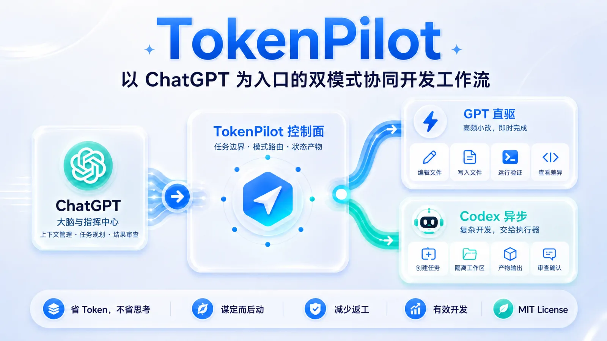
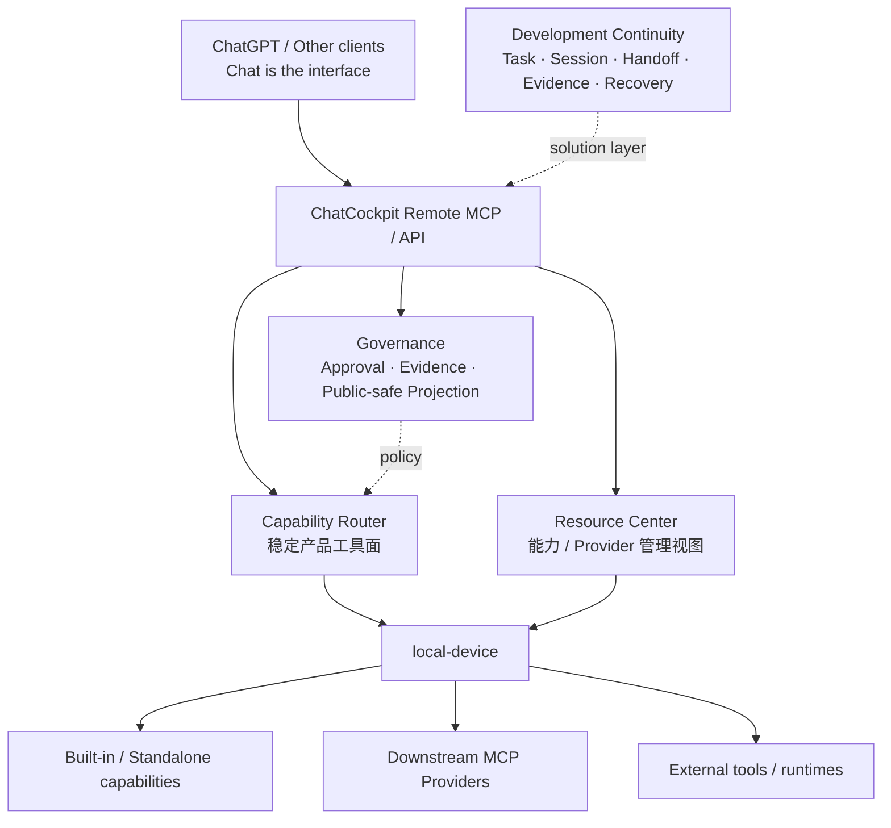

# ChatCockpit

简体中文 | [English](./README.en.md)

[](https://github.com/wuaishare/ChatCockpit/actions/workflows/verify.yml)
[](./package.json)


[](./LICENSE)




> **Chat is the interface. Cockpit is the control plane.**
> **聊天是入口，驾驶舱才是系统。**

ChatCockpit 是一个 **local-first AI capability control plane**：把本机设备、MCP、CLI、Runtime 与 AI 工具整理成可发现、可治理、可路由的能力，并通过一个稳定的 ChatCockpit 接口提供给 ChatGPT 等客户端。

它的目标不是再造一个 AI 聊天客户端、IDE、通用 Runtime 或软件商店，而是把成熟工具接入同一个安全控制面，让复杂的软件环境更容易被 Chat 使用和管理。

> **当前状态：v0.2.0-alpha。** Capability / Governance Kernel、稳定 Capability Router、Remote MCP/OAuth、Resource Center 基础、macOS/Web Operator Surface 与 Development Continuity 能力都已存在；部分 Provider 生命周期管理与更完整的软件/能力管理体验仍在持续验证。

## 核心模型



### 1. Capability，而不是 Provider 数量

ChatCockpit 对外暴露的是稳定的产品能力，而不是把每个下游工具动态变成一个新的 ChatGPT Tool。

当前 Capability Router 固定提供：

- `chatcockpit.capabilities.list`
- `chatcockpit.capabilities.inspect`
- `chatcockpit.capabilities.read.invoke`
- `chatcockpit.capabilities.mutation.prepare`
- `chatcockpit.capabilities.mutation.inspect`
- `chatcockpit.capabilities.mutation.execute`

Provider-native Tool Name 只作为 Catalog 数据存在。下游 MCP 增减或升级不会让 ChatGPT 的上游工具快照失控。

### 2. Resource Center 是管理平面

Resource Center 用统一 public-safe 模型展示本机 target、Runtime Profile、Provider、Capabilities、健康与 Inventory Snapshot，并承载受治理的资源变更入口。

ChatCockpit 不把自己的缓存或数据库伪装成 Provider 的最终真相；执行前会重新检查当前配置、Catalog 与 live metadata，必要时直接 fail closed。

### 3. 变更必须有明确 Authority

有副作用的操作遵循受治理生命周期。Capability Router mutation 使用：

```text
prepare
→ local operator approve / deny
→ execute
→ evidence / result projection
```

Remote MCP **没有 `decide` 权限**。Approval 只能由已认证本地 Operator Session 通过 REST + CSRF 作出；machine bearer、MCP OAuth 和 Remote MCP 都不能自行批准写操作。

### 4. Development Continuity 是重要能力，但不是整个产品类别

ChatCockpit 仍保留已经成熟的开发连续性系统：Project、Workspace、Task、Spec/Plan、Session、Runtime Binding、Writer Lease、Handoff、Evidence、Recovery、Codex 与异步 Job。

这些能力解决“同一个目标如何跨 ChatGPT、Codex 与异步执行继续工作”的问题，但它们现在属于 ChatCockpit 更大控制面中的 **Development solution layer**，不再定义整个产品。

## 当前已经能做什么

- **Remote MCP / OAuth**：ChatGPT 通过一个 ChatCockpit 入口访问固定、受治理的产品工具面。
- **Capability Router**：Catalog、Inspect、只读 Invoke、受治理 Provider-native Mutation；调用前执行 live `tools/list` attestation。
- **Downstream MCP**：官方 MCP Client，支持本机 stdio 与受约束的 Streamable HTTP；Provider schema/annotations 以 bounded catalog 保存。
- **Resource Center**：本机 `local-device`、Provider Management 读模型、Runtime Profiles、append-only inventory 与受治理资源操作；管理读模型统一投影检测、版本、健康、配置来源、Chat 暴露、Desired/Observed State 与 Provider-native Verification。
- **Governance**：Approval、Idempotency、Evidence、Public-safe Projection、Actor provenance；原始 mutation arguments 与 Provider result body 不写入 Governance 记录。
- **Host / Workspace 能力**：allowlisted 文件、受控命令、Git 与受治理 Managed Workspace Process；不暴露任意 raw shell 或系统级 PID 管理。
- **Development Continuity**：Task / Session / Handoff / Evidence / Recovery、显式 Codex Session、异步 Agent Job 与 Writer Lease。
- **Operator Surfaces**：macOS App、Menu Bar、Web Cockpit、CLI；Surface 之间共享同一个本机控制面与 Authority 规则。

## 为什么需要 ChatCockpit

很多 AI 工具已经分别拥有文件、Shell、Coding、MCP、Agent 或自动化能力。ChatCockpit 不要求把这些能力重新实现一遍，而是解决它们之间更难统一的部分：

- **一个入口**：ChatGPT 不必为每个本机工具维护一组独立 Connector。
- **稳定能力面**：下游工具变化不会动态污染上游 ChatGPT Tool Surface。
- **可治理变更**：读、写、审批、执行与证据边界明确。
- **Provider-native truth**：运行时状态与元数据变了就重新校验，而不是依赖旧快照继续执行。
- **本地优先**：真实机器状态、凭据、绝对路径和私有运行信息默认留在本机。
- **跨工具连续性**：需要开发接力时，Task、Handoff 与 Evidence 不依赖某个聊天窗口长期存活。

## 立即体验

| 入口 | 用途 |
|---|---|
| **ChatGPT App / Remote MCP** | 在聊天中发现和调用 ChatCockpit 能力 |
| **macOS App / Menu Bar** | 管理本机 Runtime、入口、安全与运行状态 |
| **Web Cockpit** | Resource Center、Continuity、Jobs、Integrations 与 Operator 工作流 |
| **CLI** | 本地开发、诊断、验证与自动化 |

源码模式：

```bash
npm ci
npm run setup
npm run start:local
npm run mvp:status
npm run doctor:runtime
```

不要假定 Web UI 固定为 `/ui`。全新初始化会生成随机安全入口；优先从 ChatCockpit App 打开 **本机控制台**，或查看 `npm run mvp:status` 的 `UI:` 输出。

更完整的指南：

- [新手快速开始](./docs/zh-CN/deployment/beginner-quickstart.md)
- [ChatGPT / MCP 接入](./docs/zh-CN/deployment/mcp-setup.md)
- [macOS Desktop](./docs/zh-CN/deployment/macos-desktop.md)
- [本机运行维护](./docs/zh-CN/deployment/local-runtime-ops.md)
- [本地优先控制面架构](./docs/zh-CN/architecture/local-first-control-plane.md)
- [产品原则](./docs/zh-CN/governance/product-principles.md)
- [公开 / 私有资料边界](./docs/zh-CN/governance/public-vs-private-artifacts.md)
- [ChatGPT Connector Smoke](./docs/zh-CN/testing/chatgpt-connector-smoke.md)

## 安全边界

ChatCockpit 的目标不是“让 AI 获得无限本机权限”。核心约束包括：

- 显式 allowlist 与 canonical path containment；
- 只发布有界、脱敏的 public-safe projection；
- 高风险 mutation 需要 server-side policy 与本地 Operator Authority；
- Remote MCP 不能自我批准受治理变更；
- raw downstream tool、raw shell、私有 transport config、Secret、PID 与真实本机路径不会因为本机可见就自动进入公开接口；
- Provider metadata/schema 漂移会在副作用前阻断执行。

## 项目与贡献

ChatCockpit 目前仍是 alpha。欢迎围绕当前公开合同提交 Issue / PR，尤其是：协议兼容性、安全边界、Provider 互操作、Resource Center 可靠性、macOS 打包、文档与可重复验证。

维护者内部的竞品研究、商业策略、未来 Provider 排序和实现路线不属于公开产品合同；公开仓库只描述当前产品事实与贡献者需要维护的架构不变量。

## License

[MIT](./LICENSE)
