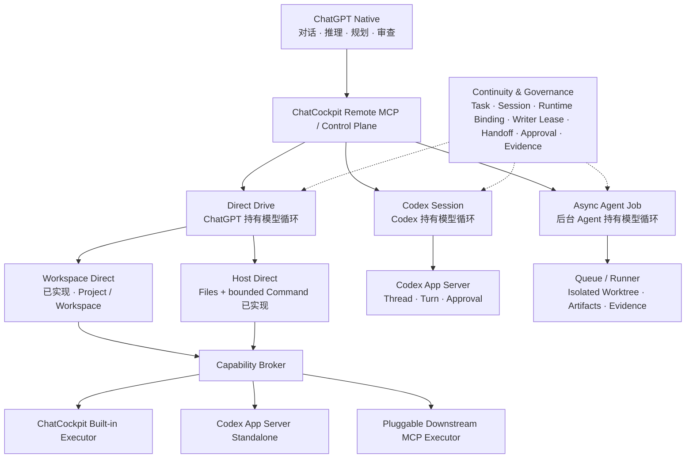

# ChatCockpit

简体中文 | [English](./README.en.md)

[](https://github.com/wuaishare/ChatCockpit/actions/workflows/verify.yml)
[](./package.json)


[](./LICENSE)


**让 ChatGPT、Codex、本地工具和异步 Agent 在同一个开发连续性控制面中协作。**

ChatCockpit 是一个 **local-first Development Continuity & Agent Routing Platform**。它把 ChatGPT 作为主要对话入口，把本机文件、Git、受控命令、Codex Session、异步 Agent Job、Approval、Handoff、Evidence 与恢复状态统一到一个可审计的控制面中。

**One repo. Multiple AI runtimes. Seamless handoff.** 一个项目，多种 AI 执行模式，无缝接力开发。

它不是另一个聊天 UI，也不是让模型获得无限制本机权限的“万能代理”。ChatCockpit 的核心目标是：**让 AI 能够持续工作，同时让 Workspace、权限、写入、审批和证据边界始终明确。**

> **v0.2.0-alpha**：真实 ChatGPT Remote MCP/OAuth、macOS Desktop、Web Cockpit、CLI 与全局 Source state 已完成端到端迁移验证；当前处于 alpha 稳定化阶段。正式 macOS 生产签名/公证仍未完成。

## 立即体验

| 入口 | 适合场景 | 怎么开始 |
| --- | --- | --- |
| **ChatGPT App / Remote MCP** | 日常对话中读取项目、查看 Git、管理 Continuity、发起受审批操作 | 在 ChatGPT 新聊天中选择已连接的 **ChatCockpit** App，或在提示词中提及它 |
| **macOS Desktop** | 原生查看 Runtime 状态、Developer/Packaged Mode、Start/Stop/Restart、打开 Web Cockpit | `open dist/macos/ChatCockpit.app` |
| **Web Cockpit / CLI** | 开发者、贡献者、本机运维与深度调试 | `npm run setup && npm run start:local`，然后打开 `http://127.0.0.1:4318/ui` |

更完整的真实交互测试见：

- [ChatGPT Connector Smoke Test](./docs/zh-CN/testing/chatgpt-connector-smoke.md)
- [macOS Desktop Smoke Test](./docs/zh-CN/testing/macos-desktop-smoke.md)
- [新手快速开始](./docs/zh-CN/deployment/beginner-quickstart.md)

## 为什么是 ChatCockpit

- **ChatGPT-first**：对话、意图、规划和审查留在 ChatGPT；需要本地执行时再调用受治理的 MCP 能力。
- **Local-first**：运行状态、Workspace 映射、Approval 与 Continuity 默认留在本机；公开仓库不保存真实 token、域名或机器路径。
- **Durable continuity**：Task、Session、Writer Lease、Handoff、Evidence 和 Runtime Binding 独立于某个聊天窗口、Codex Thread 或 Runner Job。
- **Explicit execution lanes**：Direct Drive、Codex Session、Async Agent Job 明确区分谁持有模型循环、执行发生在哪里，以及何时需要审批。
- **Fail-closed mutation**：文件写入、Host Command、Managed Workspace Process 与资源 mutation 都经过显式边界和审计，不提供无限制 raw shell 通道。

## 它做什么

ChatGPT Native 是主要对话入口，不是一个需要逐级“升级”的 Runtime Lane。需要操作本机时，ChatCockpit 提供三种显式执行方式：



底层现有 `chat-direct` Runtime Lane 保持兼容；Direct Drive 是其产品级总称。Workspace / Host / isolated Worktree 描述“执行发生在哪里”，而 Direct Drive / Codex Session / Async Agent Job 描述“谁持有模型循环以及任务如何执行”。Direct Drive 已确认采用 **ChatCockpit Capability Broker + Pluggable Downstream MCP Executor** 架构。当前 Built-in / App Server Standalone 通过统一 capability contract 发现与选择，支持 `automatic | explicit` Provider Selection，并通过 `chatcockpit.direct.executors.list` 暴露 public-safe discovery。Downstream MCP 的 local-only 配置、stdio Probe、Capability Snapshot、显式 Tool Mapping、Broker Descriptor 与内部 Execution Registry 也已实现；Host Direct 现已通过 Host Root Alias 接入受治理的 `files.read`、需要短期 single-use Approval 的文本 `files.write` / Exact `files.edit`，以及同样经过 `prepare → decide → execute` 审批的 bounded Host Command。Pure Host Command 仅允许显式只读 policy；Workspace write-effect Command 自动回流 Session / Writer Lease / Git / Task Evidence。Raw shell source、交互式/后台 Process API 和下游 Process Tool 仍不对 Remote MCP 开放。

同一个 Task 可以通过 Writer Lease、Handoff Checkpoint 与 Evidence Bundle 在不同执行方式之间接力，而不是把某个 ChatGPT 对话、Codex Thread 或 Runner Job 当成唯一系统记录。

## 能力状态

### 已实现

- 本地 CLI、Fastify Control Plane、REST、MCP 与 OpenAPI。
- Direct Drive / Workspace Direct：底层继续使用 `chat-direct` Lane，提供文件读写、目录、内容搜索、受控 Shell、Git 与统一执行审计；Capability Broker 已统一 Built-in / App Server Standalone 的 capability discovery、健康状态与显式/自动 Provider Selection，并已证明不会隐式调用 `turn/start`。Downstream MCP 已具备 local config → probe → snapshot → descriptor → normalized execution 的完整链路，并已用于 Host Direct Files 与 bounded Host Command。
- Durable Host Managed Workspace Process：通过 ChatCockpit `host_process_*` 公共身份提供受审批的 Start / Input / Stop 与只读 Read / List；独立 Process Supervisor sidecar 持有 Desktop Commander runtime/PID namespace，使合法进程可跨普通 Control Plane restart 延续，同时继续由 Writer Lease watchdog、runtime generation/ownership、Audit/Evidence 和 process-group guardian 治理。Process Output 与 raw interactive input 不进入持久 Mutation 结果，PID 始终保持私有；系统级任意 PID attach/list/kill 不开放。
- Codex Session：Thread List/Read/Bind/Resume/Fork，以及显式 Turn、Interrupt、命令/文件审批和事件读取。
- Continuity Engine：SQLite Schema v19、Project、Workspace、Task、Session、通用 Runtime Binding、Runtime Recovery Attempt、append-only Runtime Resource Snapshot、append-only Spec/Plan 文档版本、Task 文档外键与不可变版本固定、显式 Task Execution Policy、Writer Lease、Handoff、Evidence、Runtime Approval、Direct Mutation Approval/Audit、Direct Command Approval/Audit、Direct Process Session/Approval/Audit、受治理 Runtime Resource Mutation Approval/Execution/Provenance、Process Supervisor Runtime Ownership 与 Runtime Event。
- Workspace Continuity Snapshot 与 Web UI：真实 Writer、Git、Specs & Plans、Tasks、Sessions、Runtime Recovery、Handoffs、Evidence、Approvals、Planning/Completion/Recovery Blockers、Runtime Binding 与 Runner Job；Recovery Center 由服务端 Assessment 驱动，支持显式 Codex Resume/Fork/Bind、Runner Reconcile、Chat Direct/Handoff 接续，不会自动启动 `turn/start` 或自动切换 Provider。
- Runtime & Resource Center：`/ui/resources` 统一展示 public-safe Runtime Profiles 与 append-only Inventory Snapshot，已接入 Native Codex Skills/MCP/Plugins/config 摘要、Downstream MCP Executor/Adapter 与 ACP Registry Agent Catalog；受治理 mutation 已开放到 Codex Skill enable/disable 与 Codex Plugin install/uninstall。Operator REST / Resource Center 支持 prepare → review/decide → execute；Remote MCP 只开放 prepare / inspect / execute，不能自行 decide，并且 exposed deployment 只有显式设置 `CHATCOCKPIT_RESOURCE_MUTATIONS_EXPOSED=true` 才注册这些 mutation tools。
- Async Agent Job：file-backed Queue、Runner、`createCodexRun`、Artifacts、可选 Worktree，以及 Task/Session/Binding 身份、Claim、终态 Evidence 和重启恢复对账。
- 默认 exposed-mode MCP catalog 为 62 个 tools，包含 Direct Drive Executor discovery、Host Root Alias discovery、Host Direct file read、`prepare → decide → execute` 的受审批 Host Write / Exact Edit、bounded Host Command、ChatCockpit-owned Managed Workspace Process、`chatcockpit.recovery.assess` / `chatcockpit.recovery.execute`，以及 `chatcockpit.resources.inventory` / `chatcockpit.resources.inspect`。本地非 exposed 模式或显式开启 Resource Mutation exposure 后，再注册 `chatcockpit.resources.mutation.prepare` / `inspect` / `execute` 3 个受约束工具（共 65 个），始终不注册 MCP `decide` / `reconcile`；同时提供 exposed-mode Bearer/OAuth 鉴权、public-safe 投影、历史隐私扫描与无 `.git` 源包门禁。

### 实验性

- ChatGPT custom MCP app / Remote MCP 的跨客户端、refresh/reconnect 与长期运行稳定性。
- Codex App Server standalone 文件与命令执行；能力由本机 Probe 验证后才启用。
- Continuity Workbench 的交互式运行时治理。

### 验证中

- 不同 ChatGPT 客户端、网络代理和公网 HTTPS 入口的长期兼容性。
- 更多真实项目中的跨模式 Handoff 恢复与长时间运行行为。

## 操作员 Web UI

Web UI 是本地操作员控制台。除 Dashboard、Jobs、Setup Wizard 与 GPT Helper 外，Continuity Workbench 还提供 Projects、Specs & Plans、Tasks、Sessions、Recovery、Handoffs、Evidence、Approvals 八个稳定深链；独立 `/ui/resources` Resource Center 提供 Runtime Profile 选择、显式资源刷新、snapshot diff、Skills/MCP/Plugins/Adapters/ACP Agents 分类清单与详情检查，并对已获治理支持的 Codex Skill enable/disable 与 Codex Plugin install/uninstall 提供 prepare → review/decide → execute 工作流。Specs & Plans 可管理真实文档版本、哈希、生命周期、审批和 Task 绑定；Task 视图直接消费服务端 Planning Assessment，不在浏览器端推断执行资格。


在需要鉴权的模式下，浏览器会话提供 bearer token 前，受保护数据不会展示。

## 开始使用

### 1. Source / Web Cockpit

适合贡献者和本地开发：

```bash
npm ci
npm run setup
npm run start:local
npm run mvp:status
npm run doctor:runtime
```

打开：

```text
http://127.0.0.1:4318/ui
```

Source/Developer Mode 的 canonical state 位于 `~/.chatcockpit/`，与源码 checkout 分离。

### 2. macOS App

如果已经构建过当前 App：

```bash
open dist/macos/ChatCockpit.app
```

当前 Source services 正在运行时，优先在 App Settings 中使用 **Developer Mode**；切换到 Packaged Mode 时，ChatCockpit 会显式检测 ownership conflict，而不是自动抢占现有 LaunchAgents。

完整测试步骤：[`docs/zh-CN/testing/macos-desktop-smoke.md`](./docs/zh-CN/testing/macos-desktop-smoke.md)。

macOS Desktop 还提供 Self-contained Packaged Mode：App 内含固定 Node `24.18.1` 与 production runtime payload，不要求目标机器另装 Node/npm。当前 development App/DMG 仍是 development trust，尚未完成 Developer ID / Apple notarization。更多边界见 [`docs/zh-CN/deployment/macos-desktop.md`](./docs/zh-CN/deployment/macos-desktop.md) 与 [`docs/zh-CN/deployment/macos-release.md`](./docs/zh-CN/deployment/macos-release.md)。

### 3. ChatGPT App / Remote MCP

ChatCockpit 可作为自定义 MCP App 连接到 ChatGPT。连接完成后，在新的 ChatGPT 对话中从工具菜单选择 **ChatCockpit**，或者在提示词中明确要求使用 ChatCockpit。

推荐从只读路径开始：

```text
使用 ChatCockpit 列出当前 Projects，然后查看 primary Workspace snapshot 和 git status。
不要修改任何内容，并告诉我实际调用了哪些 ChatCockpit tools。
```

再逐步测试 Continuity、Approval、Codex Session 与 Async Agent Job。完整 smoke matrix：[`docs/zh-CN/testing/chatgpt-connector-smoke.md`](./docs/zh-CN/testing/chatgpt-connector-smoke.md)。

本地可重复配置位于 `~/.chatcockpit/runtime/server.env`。只有在已经配置好 HTTPS 与访问凭据时才使用 `CHATCOCKPIT_EXPOSED=true`；真实域名、token、隧道凭据和机器路径不要提交到 Git。

## ChatGPT App / Remote MCP

ChatGPT custom MCP app / Remote MCP 已完成真实 OAuth 与工具调用验证；它仍属于 alpha 产品面，需要继续验证不同 ChatGPT 客户端、网络代理、refresh/reconnect 和长时间运行行为。ChatGPT 端应使用 `chatcockpit:mcp` authority；0.2.x 不会把 legacy MCP scope 静默升级为新权限。

公开 OpenAPI 合约仍位于 [`openapi/chatcockpit.openapi.yaml`](./openapi/chatcockpit.openapi.yaml)，主要用于 REST / Actions 兼容与调试；Remote MCP 使用 `/mcp`。仓库中的 `https://chatcockpit.example.com` 是占位域名，真实 endpoint 和 bearer/OAuth authority 不应提交到 Git。

Direct Drive 适合由 ChatGPT 保持模型循环的确定性本机操作；当前已实现 Workspace Direct，以及受 Host Root Alias / 路径策略约束的 Host Direct Files 与 bounded Host Command。文本 Write / Exact Edit 使用 Direct Mutation Approval；Host Command 使用独立 Direct Command Approval，Workspace write-effect Command 自动回流 Writer Lease / Git / Task Evidence。Raw unrestricted shell 不对 Remote MCP 开放。显式 Codex Session 适合需要 Codex Thread、Turn 与 Approval 的交互式 Agent 工作；更长或适合隔离执行的任务可进入 Async Agent Job。

`runShell` 不是 raw shell，Standalone `command/exec` 也不会绕过 ChatCockpit 的命令白名单、工作区 allowlist、exposed-mode 高信任开关、超时与输出上限。公网或隧道访问必须经过对应入口的明确鉴权：Web 使用控制台管理员会话，ChatGPT MCP 使用 scoped OAuth；只有 CLI、自动化或兼容 API 客户端需要机器 Bearer 时才按需配置机器 API 令牌。

相关文档：

- ChatGPT Connector Smoke：[`docs/zh-CN/testing/chatgpt-connector-smoke.md`](./docs/zh-CN/testing/chatgpt-connector-smoke.md)
- MCP 接入：[`docs/zh-CN/deployment/mcp-setup.md`](./docs/zh-CN/deployment/mcp-setup.md)
- GPT Builder / Actions 兼容路径：[`docs/zh-CN/deployment/gpt-builder-setup.md`](./docs/zh-CN/deployment/gpt-builder-setup.md)
- 公网 HTTPS / tunnel：[`docs/zh-CN/deployment/public-https-tunnel.md`](./docs/zh-CN/deployment/public-https-tunnel.md)

## Codex Task Pack 最小模板

把下面结构交给 ChatGPT，再让它为 Codex 生成明确任务包：

````md
# Codex Task Pack

## 1. 目标

用一句话说明要解决的问题。

## 2. 上下文

只保留当前任务必要背景。

## 3. 范围

必须检查：
- path/to/file-a
- path/to/directory-b

必要时可以检查：
- path/to/related-module

禁止修改：
- path/to/unrelated-module
- package manager config
- global theme tokens

## 4. 执行要求

1. 先确认真实根因。
2. 做最小可验证改动。
3. 不引入无关依赖。
4. 保持现有风格。

## 5. 验证

```bash
npm run lint
npm run build
npm run test
```

## 6. 验收标准

- 原问题消失。
- 验证命令通过。
- diff 没有超出范围。
- 既有行为没有被破坏。
````

## 公开文档

- 新手快速开始：[`docs/zh-CN/deployment/beginner-quickstart.md`](./docs/zh-CN/deployment/beginner-quickstart.md)
- ChatGPT Connector Smoke：[`docs/zh-CN/testing/chatgpt-connector-smoke.md`](./docs/zh-CN/testing/chatgpt-connector-smoke.md)
- macOS Desktop Smoke：[`docs/zh-CN/testing/macos-desktop-smoke.md`](./docs/zh-CN/testing/macos-desktop-smoke.md)
- GPT Builder 配置：[`docs/zh-CN/deployment/gpt-builder-setup.md`](./docs/zh-CN/deployment/gpt-builder-setup.md)
- MCP 接入：[`docs/zh-CN/deployment/mcp-setup.md`](./docs/zh-CN/deployment/mcp-setup.md)
- 公网 HTTPS / 内网穿透：[`docs/zh-CN/deployment/public-https-tunnel.md`](./docs/zh-CN/deployment/public-https-tunnel.md)
- 本地运行参考：[`docs/zh-CN/deployment/local-runtime-ops.md`](./docs/zh-CN/deployment/local-runtime-ops.md)
- 架构说明：[`docs/zh-CN/architecture/local-first-control-plane.md`](./docs/zh-CN/architecture/local-first-control-plane.md)
- Continuity Engine：[`docs/zh-CN/architecture/continuity-engine.md`](./docs/zh-CN/architecture/continuity-engine.md)
- Chat Direct / Codex Session ADR：[`docs/zh-CN/architecture/adr-001-chat-direct-and-codex-session-lanes.md`](./docs/zh-CN/architecture/adr-001-chat-direct-and-codex-session-lanes.md)
- GPT Actions runner loop：[`docs/zh-CN/architecture/gpt-actions-runner-loop.md`](./docs/zh-CN/architecture/gpt-actions-runner-loop.md)
- Files Read API：[`docs/zh-CN/engineering/files-read-api.md`](./docs/zh-CN/engineering/files-read-api.md)
- 产品原则：[`docs/zh-CN/governance/product-principles.md`](./docs/zh-CN/governance/product-principles.md)
- 公共 / 私有产物治理：[`docs/zh-CN/governance/public-vs-private-artifacts.md`](./docs/zh-CN/governance/public-vs-private-artifacts.md)
- RTK 工程说明：[`docs/zh-CN/engineering/rtk.md`](./docs/zh-CN/engineering/rtk.md)

真实域名、反向代理、tunnel、Bearer token 和 GPT Builder 操作记录属于本地配置，不应提交到 Git。

## 当前能力状态

- [x] 本地 CLI、pack、manifest、taskpack
- [x] 本地 control plane、runner 与异步 job queue
- [x] OpenAPI、REST/MCP Parity 与 exposed-mode 鉴权
- [x] Chat Direct 文件、搜索、受控命令、Git 与 No-Turn 门禁
- [x] Codex App Server Thread Bind/Resume/Fork 与显式 Turn/Approval/Interrupt
- [x] SQLite Continuity Engine、Writer Lease、Handoff、Evidence 与 Runtime Event
- [x] Continuity Workbench 与真实 Workspace Snapshot
- [x] Schema v7 版本化 Spec/Plan、Task 版本固定与 planning-required/planning-optional 门禁
- [x] OAuth 持久化、恢复、撤销与公共错误边界
- [x] 无 Git 源码包、隐私、路径安全与发布验证门禁
- [x] First-run Setup Wizard、首任务模板与新手文档

未发布的产品分支不再作为内部路线图直接写入 README；对外计划以公开 Issues、Discussions 和 Release 记录为准。

## 安全与隐私

ChatCockpit 明确区分公开产品代码和私有 operator 事实。

不要提交：

- API keys、bearer tokens、cookies、local session files。
- 真实部署域名、tunnel tokens、private IP、internal hostnames。
- 个人绝对路径或机器相关运行态。
- `.codex/`、全局 `~/.chatcockpit/runtime/`、兼容期历史 `.tokenpilot/runtime/`、`.servbay/`、生成调试记录或私有规划材料。

提交前至少运行：

```bash
npm run verify:knowledge-boundary
npm run verify:web:safety
npm run privacy:scan:history
```

`npm run privacy:scan:history` 是只读扫描。历史泄露需要经过审查的 history rewrite 和协调后的 force-push；普通清理提交只能保护未来快照。

## 讨论

ChatCockpit 是一个实验性开源的 AI 开发连续性与 Agent 能力路由平台，面向 ChatGPT Native、Chat Direct、Codex Session、Async Agent Job 之间的可审计接力，以及 Token-conscious Planner / Coder / Reviewer 工作流。

- GitHub Discussions: <https://github.com/wuaishare/ChatCockpit/discussions>
- GitHub Issues: <https://github.com/wuaishare/ChatCockpit/issues>
- Pull Requests: 欢迎提交模板、文档、示例和工具改进。

## 免责声明

ChatCockpit 与 OpenAI、ChatGPT、Codex 或 GitHub 没有关联。它不会绕过任何平台限制，只是用更清晰的任务边界、更少的重复上下文、更安全的本地执行和更好的复盘审查，把现有工具串成可控工作流。

## 参考

- OpenAI Codex Web: <https://developers.openai.com/codex/cloud>
- OpenAI Codex Models: <https://developers.openai.com/codex/models>

## 许可证

[MIT License](./LICENSE)
