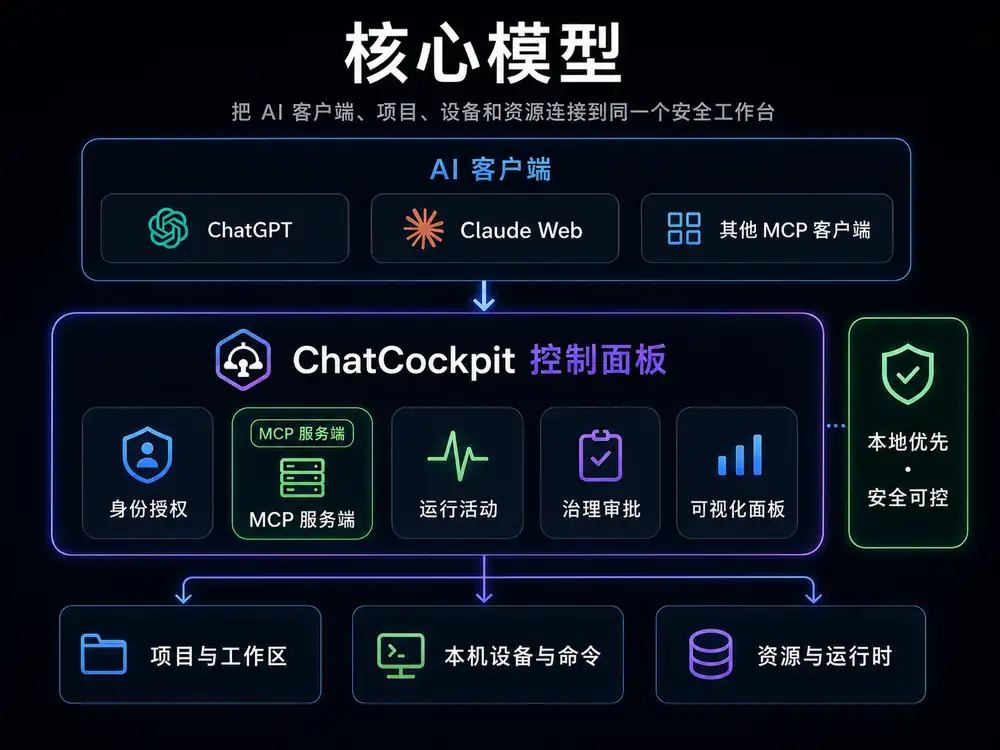

# ChatCockpit

简体中文 | [English](./README.en.md)

[](https://github.com/wuaishare/ChatCockpit/actions/workflows/verify.yml)
[](./package.json)


[](./LICENSE)


> **Chat is the interface. Cockpit is the control plane.**
> **聊天是入口，驾驶舱才是系统。**

ChatCockpit 是一个 **本地优先的 AI 工作中控台**：让 ChatGPT、Claude Web 和其他支持 MCP 的 AI 客户端，通过一个统一入口安全地连接项目、本机设备、命令、资源与运行时。

它把身份授权、MCP 服务端、实时运行活动、治理审批和可视化管理集中到一起，让 AI 能做事，也让人始终看得见、管得住，并能在需要时撤销授权。

它的目标不是再造一个 AI 聊天客户端、IDE、通用 Runtime 或软件商店，而是把成熟工具接入同一个安全控制面，让复杂的软件环境更容易被 Chat 使用和管理。

> **当前状态：v0.2.0-alpha。** Capability / Governance Kernel、稳定 能力路由、Remote MCP/OAuth、资源中心 基础、macOS/Web 管理界面 与 开发连续性 能力都已存在；部分 Provider 生命周期管理与更完整的软件/能力管理体验仍在持续验证。

## 核心模型



可以把 ChatCockpit 理解成 **AI 客户端与本机工作环境之间的一层安全控制面板**：

- **上面连接 AI 客户端**：ChatGPT、Claude Web，以及其他支持 MCP 的客户端。
- **中间由 ChatCockpit 统一管理**：身份授权、MCP 服务端、实时运行活动、治理审批与可视化操作。
- **下面连接真正的工作对象**：项目与工作区、本机设备与命令、资源与运行时。

AI 客户端不必直接理解每一种本机工具；ChatCockpit 负责把这些能力整理成稳定、可观察、可治理的工作入口。
## 当前已经能做什么

- **Remote MCP / OAuth**：ChatGPT 通过一个 ChatCockpit 入口访问固定、受治理的产品工具面；每次 Owner 批准形成独立 Authorization Grant，Access/Refresh Token 绑定该 Grant，旧 OAuth 数据可无感迁移并继续使用现有 Refresh Token；Web Owner 可查看授权关系并单独撤销其中一条 Token Family。
- **能力路由**：Catalog、Inspect、只读 Invoke、受治理 Provider-native Mutation；调用前执行 live `tools/list` attestation。
- **Downstream MCP**：官方 MCP Client，支持本机 stdio 与受约束的 Streamable HTTP；Provider schema/annotations 以 bounded catalog 保存。
- **资源中心**：本机 `local-device`、提供方管理 读模型、运行时配置、append-only inventory 与受治理资源操作；管理读模型统一投影检测、版本、健康、配置来源、Chat 暴露、Desired/实际状态 与 Provider-native Verification。
- **Governance**：Approval、Idempotency、Evidence、Public-safe Projection、Actor provenance；原始 mutation arguments 与 Provider result body 不写入 Governance 记录。
- **Host / Workspace 能力**：allowlisted 文件、受控命令、Git 与受治理 Managed Workspace Process；不暴露任意 raw shell 或系统级 PID 管理。
- **开发连续性**：Task / Session / Handoff / Evidence / Recovery、显式 Codex Session、异步 Agent Job 与 Writer Lease。
- **管理界面s**：macOS App、Menu Bar、Web Cockpit、CLI；Surface 之间共享同一个本机控制面与 Authority 规则。

## 为什么需要 ChatCockpit

很多 AI 工具已经分别拥有文件、Shell、Coding、MCP、Agent 或自动化能力。ChatCockpit 不要求把这些能力重新实现一遍，而是解决它们之间更难统一的部分：

- **一个入口**：ChatGPT 不必为每个本机工具维护一组独立 Connector。
- **稳定能力面**：下游工具变化不会动态污染上游 ChatGPT Tool Surface。
- **可治理变更**：读、写、审批、执行与证据边界明确。
- **Provider-native truth**：运行时状态与元数据变了就重新校验，而不是依赖旧快照继续执行。
- **本地优先**：真实机器状态、凭据、绝对路径和私有运行信息默认留在本机。
- **跨工具连续性**：需要开发接力时，Task、Handoff 与 Evidence 不依赖某个聊天窗口长期存活。

## 立即体验

| 入口 | 用途 |
|---|---|
| **ChatGPT App / Remote MCP** | 在聊天中发现和调用 ChatCockpit 能力 |
| **macOS App / Menu Bar** | 管理本机 Runtime、入口、安全与运行状态 |
| **Web Cockpit** | 资源中心、Continuity、Jobs、Integrations 与 Operator 工作流 |
| **CLI** | 本地开发、诊断、验证与自动化 |

源码模式：

```bash
npm ci
npm run setup
npm run start:local
npm run mvp:status
npm run doctor:runtime
```

不要假定 Web UI 固定为 `/ui`。全新初始化会生成随机安全入口；优先从 ChatCockpit App 打开 **本机控制台**，或查看 `npm run mvp:status` 的 `UI:` 输出。

更完整的指南：

- [新手快速开始](./docs/zh-CN/deployment/beginner-quickstart.md)
- [ChatGPT / MCP 接入](./docs/zh-CN/deployment/mcp-setup.md)
- [macOS Desktop](./docs/zh-CN/deployment/macos-desktop.md)
- [本机运行维护](./docs/zh-CN/deployment/local-runtime-ops.md)
- [本地优先控制面架构](./docs/zh-CN/architecture/local-first-control-plane.md)
- [产品原则](./docs/zh-CN/governance/product-principles.md)
- [公开 / 私有资料边界](./docs/zh-CN/governance/public-vs-private-artifacts.md)
- [ChatGPT Connector Smoke](./docs/zh-CN/testing/chatgpt-connector-smoke.md)

## 安全边界

ChatCockpit 的目标不是“让 AI 获得无限本机权限”。核心约束包括：

- 显式 allowlist 与 canonical path containment；
- 只发布有界、脱敏的 安全投影 projection；
- 高风险 mutation 需要 server-side policy 与本地 Operator Authority；
- Remote MCP 不能自我批准受治理变更；
- raw downstream tool、raw shell、私有 transport config、Secret、PID 与真实本机路径不会因为本机可见就自动进入公开接口；
- Provider metadata/schema 漂移会在副作用前阻断执行。

## 项目与贡献

ChatCockpit 目前仍是 alpha。欢迎围绕当前公开合同提交 Issue / PR，尤其是：协议兼容性、安全边界、Provider 互操作、资源中心 可靠性、macOS 打包、文档与可重复验证。

公开仓库只描述当前已实现产品行为、公开接口与贡献者需要维护的架构不变量。

## License

[MIT](./LICENSE)
